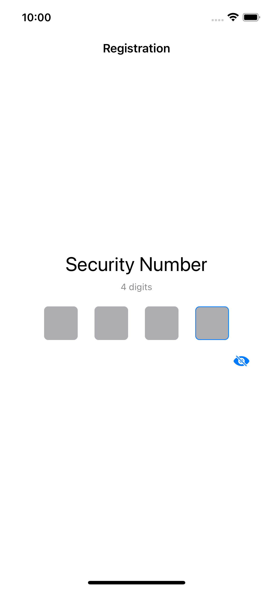

### Screenshots

|  |  |
| - | - |
|  |  | 

In the project, I implemented user registration UI features like pin code and Touch ID. While a smart contract wallet is more commonly associated with Solidity. If I have more time, I will  utilizing a third-party SDK to create a demonstration for it.

### Implemented Requirements